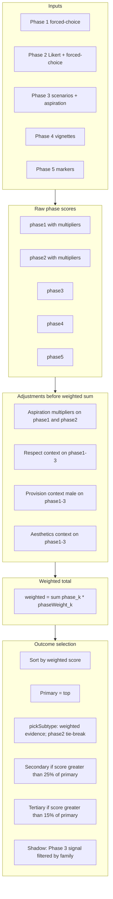

# Archetype weighting and assessment process — audit plan

## Purpose

Confirm that **phase weights**, **per-question weights**, **post-hoc adjustments**, and **selection rules** (primary / secondary / tertiary / subtypes / shadows) work together so that:

1. **Intended outcomes** (core groups and subtypes in [`archetype-data/archetypes.js`](../archetype-data/archetypes.js)) are **reachable** without dead zones or systematic bias.
2. **Observed outcome distributions** (from simulation or field data) are **plausible** relative to [`archetype-data/archetype-spread.js`](../archetype-data/archetype-spread.js) population proportions — not as a hard statistical fit, but as a sanity check.
3. **Edge cases** (IQ funnel, female ID mapping, aspiration, respect/provision/aesthetics contexts) do not **collapse** distinct archetypes into one label or **inflate** rare types.

This document is an **audit playbook** (what to verify and how). It does not change product behavior until executed.

---

## System map (reference)

Implementation lives primarily in [`archetype-engine.js`](../archetype-engine.js).

**Key code anchors**

| Concern | Location |
|--------|----------|
| Phase scoring multipliers | `scorePhase1Answer` … `scorePhase5Answer` (e.g. phase1 ×3, phase2 ×2, phase4 ×0.5) |
| Final phase weights (male vs female) | `calculateFinalScores()` — `phaseWeights` object (~lines 1540–1554) |
| Context adjustments | `calculateFinalScores()` — aspiration, respect, provision, aesthetics |
| Primary / secondary / tertiary | `identifyArchetypes()` — 25% / 15% thresholds |
| Subtype replacement | `pickSubtype()` — ranks by **weighted** subtype evidence; **phase2** is tie-break |
| IQ funnel | `buildPhase1Sequence` / `filterQuestionsByIQ`, `buildPhase2Sequence` |
| Gender ID mapping | Repeated `femaleMapping` in scoring + `identifyArchetypes` `genderMapping` |

---

## Audit workstreams

### A. Phase weight calibration (static)

**Objective:** Documented phase weights match the **intended** share of influence on `weighted` (comments in [`calculateFinalScores`](../archetype-engine.js) cite male vs female targets).

**Checks**

1. Recompute **effective contribution** per phase: for a representative archetype, with fixed raw phase totals, verify `weighted` changes as expected when one phase’s raw is perturbed (spreadsheet or small script).
2. Confirm **Phase 5 question count** changes (commented in `calculateFinalScores`) still align with **6% male / 9% female** targets; if Phase 5 questions are added/removed, recalibrate `phase5` weight.
3. Verify **phase4** weight (0.0467 × 0.5 raw multiplier) is consistent with “5% validation” intent.

**Pass criteria:** Single source of truth for `phaseWeights` + changelog; no duplicate magic numbers elsewhere.

---

### B. Question inventory vs archetype taxonomy (coverage)

**Objective:** Every **non-phi** archetype ID that appears in reports can receive **non-zero** signal from at least one phase, and **shadow** archetypes are reachable via Phase 3 + family rules.

**Checks**

1. Parse [`archetype-questions.js`](../archetype-data/archetype-questions.js) (and Phase 5 splits) for all `archetypes` / `options[].archetypes` references; build a **set of IDs** per phase.
2. Diff against `ARCHETYPES` keys for the active gender (or both).
3. Flag **orphan IDs** (in questions but not in `ARCHETYPES`) and **unreferenced IDs** (in taxonomy, never scored — may be intentional for phi-only or narrative-only).

**Pass criteria:** No orphan IDs; unreferenced IDs documented (e.g. rare paths, gender-only).

---

### C. Subtype navigation (`pickSubtype`)

**Objective:** Subtypes are chosen in a way that **matches** user-facing “nuance within the primary group”.

**Current behavior:** Subtypes are ranked by **`phase2` score only** (`pickSubtype`), not by full `weighted` score.

**Checks**

1. Construct **synthetic score objects** where `weighted` ranks subtype A above B but `phase2` ranks B above A — document whether primary label should follow **subtype** or **overall** (product decision).
2. Verify each parent in `CORE_GROUPS` / `subtypes` arrays has **enough Phase 2 questions** targeting each subtype (not only one subtype).

**Pass criteria:** Either accept “phase2 drives subtype” as spec and test for it, or **change** to weighted/subtype blend — decision recorded.

---

### D. Secondary and tertiary gates

**Objective:** 25% / 15% rules relative to **primary** avoid noise without hiding real blends.

**Checks**

1. Sensitivity: vary primary score; when secondary is **24%** vs **26%** of primary, confirm UX expectation (single vs dual influence).
2. Ensure **tertiary** does not duplicate secondary when sorted list contains same family (optional: dedupe rule audit).

**Pass criteria:** Thresholds documented; edge cases (near-zero primary) handled without crash or nonsense confidence.

---

### E. Context adjustments (aspiration, respect, provision, aesthetics)

**Objective:** Multipliers **do not** overpower phase-weighted evidence or create **instability** (small answer changes flip primary).

**Checks**

1. **Aspiration:** Trace `analyzeAspirations()` → `adjustments`; confirm only phase1/phase2 scaled as coded.
2. **Respect:** `calculateRespectContextAdjustments` patterns (`low_high`, etc.) — **spot-check** `beta_nu`, `beta_rho`, `beta_iota` coverage: adjustment tables use **canonical** base IDs; `calculateFinalScores` applies via `baseId` strip of `_female` — verify **female** rows receive the same multipliers as intended.
3. **Provision (male):** Low provision block — confirm `dark_delta`, `beta_rho`, etc. are not missing from adjustment tables if they should be nudged.
4. **Aesthetics:** Read `calculateAestheticsContextAdjustments` (or equivalent) and list **which archetypes** move; confirm no single archetype always wins.

**Pass criteria:** Table of adjustment keys × phases; **no** adjustment key that never matches any archetype score object.

---

### F. Gender mapping and collisions

**Objective:** Female `femaleMapping` maps (e.g. `alpha_rho` → `alpha_xi_female`, `beta_iota` → `alpha_unicorn_female`) are **intentional** and documented.

**Checks**

1. List every **non-identity** mapping; one-line rationale + link to `ARCHETYPES` entry.
2. Confirm **Phase 4** scoring paths apply gender **where Phase 4 questions include archetypes** (audit `scorePhase4Answer` for gender map — known risk if vignettes use neutral IDs only).

**Pass criteria:** Mapping doc; Phase 4 parity verified or gap filed.

---

### G. IQ bracket funnel

**Objective:** `filterQuestionsByIQ` / reduced Phase 1 count does not **skew** core group distribution vs full questionnaire.

**Checks**

1. For each IQ bracket, record **which Phase 1 questions** are included/excluded.
2. Run **A/B**: same synthetic persona, full vs IQ-filtered set; compare top-3 core groups.

**Pass criteria:** Documented delta; optional minimum question count per archetype family.

---

### H. Distribution and spread sanity (empirical)

**Objective:** Simulated or anonymized aggregate outcomes are not wildly off [`archetype-spread.js`](../archetype-data/archetype-spread.js) `socialProportion` (order-of-magnitude).

**Checks**

1. **Monte Carlo** or **scripted personas** (deterministic answer vectors) generating 1k–10k runs with randomness only in shuffle/order if needed.
2. Compare **histogram** of primary archetype family (Alpha/Beta/…) to cluster sums in spread.
3. Track **phi** and **shadow** rates separately (expected rare).

**Pass criteria:** No single family > ~90% in simulation; phi not defaulting high.

---

### I. Shadow reporting

**Objective:** `getShadowPatternsForReport()` aligns with user mental model (“shadow of **my** families”).

**Checks**

1. Unit-style test: fixed `archetypeScores` + primary/secondary/tertiary — assert shadow list membership.
2. Confirm Phase 3 questions **tag** shadow archetypes consistently.

---

## Deliverables

| Deliverable | Description |
|-------------|-------------|
| **Weighting memo** | Table: phase raw multipliers × `phaseWeights` = effective weight per phase |
| **Coverage matrix** | Archetype ID × Phase × (question count or max weight) |
| **Mapping sheet** | Gender + IQ + context adjustments |
| **Simulation report** | Histograms + edge-case narratives |
| **Gap list** | P0/P1 bugs (e.g. Phase 4 gender, missing adjustment keys) |

---

## Execution order (recommended)

1. **A** + **B** (static, fast) — foundation.
2. **C** + **D** (selection rules) — product logic.
3. **E** + **F** (context + gender) — risk of silent mis-scoring.
4. **G** + **H** (funnel + distribution) — external validity.
5. **I** (shadow) — report consistency.

---

## Out of scope (unless expanded)

- Temperament / polarity engine ([`temperament-scoring.js`](../temperament-data/temperament-scoring.js)) — separate weighting model.
- SMV / attraction engines — separate audits.

---

## Related files

- [`archetype-engine.js`](../archetype-engine.js) — scoring pipeline
- [`archetype-data/archetype-questions.js`](../archetype-data/archetype-questions.js) — all question definitions
- [`archetype-data/archetypes.js`](../archetype-data/archetypes.js) — taxonomy, `subtypes`, `parentType`
- [`archetype-data/archetype-spread.js`](../archetype-data/archetype-spread.js) — reference proportions
