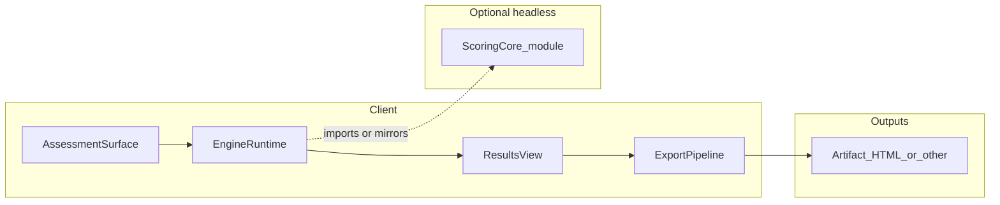

# Engine proofing blueprint

Portable pattern for validating **assessment engines**: interactive flows, results UI, export artifacts, scoring logic, and data consistency. Use neutral placeholders (*Surface A*, *Engine 1*, *scoring module*) when copying this doc into other projects.

---

## Purpose

A single user-facing “engine” usually spans:

- **UI wiring** (phases, buttons, visibility of results region)
- **Client state** (including persistence, if any)
- **Export pipeline** (HTML, PDF, JSON, etc.)
- **Deterministic scoring** (ideally testable without a browser)
- **Data catalogs** (questions, weights, taxonomies) staying in sync

Proofing only in the browser misses pure-logic bugs; proofing only in Node misses DOM and download behavior. This blueprint uses **stacked layers** so each class of failure has a home.

---

## Reference architecture (generic)

- **AssessmentSurface** — Page or route hosting the questionnaire (static HTML, SPA route, etc.).
- **EngineRuntime** — Class or module that advances phases, holds answers, computes or requests scores.
- **ResultsView** — DOM region shown when the flow completes (often toggled with a `hidden` class or router).
- **ExportPipeline** — Function that builds an artifact and triggers download or share.
- **ScoringCore** — Pure functions importable from Node (recommended); if logic lives only in bundled UI, add a thin extraction or duplicate minimal fixtures for Layer B.

---

## Layer A — End-to-end UI smoke (browser)

**Tool class:** Browser automation (e.g. Playwright, Cypress).

**What it proves**

- The app serves correctly from a static or dev server.
- A **fast path** to results exists where the product supports it (e.g. “sample / demo report”); otherwise automate a capped number of steps.
- The **results region** becomes visible and is not stuck behind a broken transition.
- **Save / export** runs without throwing; the **artifact** downloads and meets minimal shape checks (e.g. `DOCTYPE` or `<html`, minimum size, stable title or heading substrings).

**Typical setup**

| Concern | Pattern |
|--------|---------|
| Server | `webServer` in config or separate `serve` step on a fixed port |
| Isolation | Clear `localStorage` / `sessionStorage` before each run if engines restore state |
| Export | `waitForEvent('download')`, read file from temp path or `saveAs` |
| CI | Install **browser + OS dependencies**; use a **project-local `PLAYWRIGHT_BROWSERS_PATH`** if hosted runners or sandboxes shadow the default cache |
| Failure artifacts | Traces, screenshots on failure, HTML report upload |

**Coverage matrix (fill per project)**

| Surface ID | Entry URL | Results selector | Export trigger selector | Invariant strings (non-secret) |
|------------|-----------|------------------|-------------------------|--------------------------------|
| *Surface_1* | `/path/to/surface1` | `#resultsRegion` | `#saveResults` | *Heading A*, *section B* |
| *Surface_2* | … | … | … | … |

Use **stable, user-visible** strings; avoid brittle full-page snapshots for copy that still changes often.

---

## Layer B — Scoring / logic regression (Node, no DOM)

**Tool class:** Small Node script (`.mjs` / `.cjs`) run via `npm run …`.

**What it proves**

- Outputs stay finite (no `NaN` / `Infinity` where invalid).
- **Monotonicity** or **ordering** invariants where the domain expects them (e.g. raising one input bucket does not lower a headline score without reason).
- **Weight / ID drift**: when question IDs or weights change, the script fails loudly if assumptions break.

**Pattern**

1. Import **ScoringCore** from the same module the UI uses, *or* duplicate a **minimal** weight table in the script that must be kept in sync (document the coupling).
2. Generate a **grid** or **sweep** of synthetic responses.
3. Assert invariants; exit non-zero on violation.

This layer is cheap to run in CI and does not require browsers.

---

## Layer C — Data / taxonomy integrity (static)

**Tool class:** Node script or one-off checker that **reads files only** (no browser).

**What it proves**

- Every **ID referenced** in question definitions exists in the **canonical taxonomy** (and vice versa where required).
- No orphaned option keys, duplicate IDs, or broken imports between data files.

**Pattern**

- Parse or regex-extract identifiers from **bank A** and **bank B**; diff sets; print symmetric difference and exit non-zero.

Run on demand or in CI when data churn is high.

---

## Layer D (optional) — Build / deploy parity

**Tool class:** Copy or build step (e.g. “sync source tree → packaged `www/` or app bundle”).

**What it proves**

- What you **test in CI** (served root) matches what **ships** in a wrapper (Capacitor, Tauri, embedded WebView).

**Pattern**

- Document a single canonical command (e.g. “CI serves directory X after sync”).
- Optionally run Layer A **twice** (pre-sync and post-sync) if two trees must both stay valid.

---

## How to adopt in another project

1. **Inventory surfaces** — List each URL/route with its own engine runtime and export type.
2. **Add Layer A** — One automated test per surface: open → reach results → export → assert invariants.
3. **Prefer a fast path** — If you add “sample report,” wire it consistently (`#generateSampleReport` or equivalent).
4. **Extract or mirror ScoringCore** — Enable Layer B without headless browser cost.
5. **Add Layer C** when** — You maintain parallel JSON/JS question and taxonomy files.
6. **Wire npm scripts** — e.g. `test` / `test:e2e`, `playwright:install`, domain-specific `logic:check`, `data:audit`.
7. **CI** — Run Layer A + B (+ C if present) on push/PR; upload Playwright report on failure.

---

## Appendix (optional): internal mapping

If this file lives in a concrete repo, you may add one column mapping placeholders to real paths **below this line**. For a **clean export** to other projects, delete the table or leave it empty.

| Placeholder | Implementation notes |
|-------------|------------------------|
| *Surface_1* | Static HTML pages: `archetype.html`, `temperament.html`, `attraction.html`, `relationship.html`; engines `*-engine.js`. |
| *ScoringCore* | Domain logic in engines + `*-data*` / `shared/*-core.mjs`; extract for headless checks as needed. |

**This repo:** Sample flows use `#generateSampleReport` where present. On **native Android**, Polarity and Attraction are additionally gated by Play Billing ([ANDROID_IAP.md](ANDROID_IAP.md)); web/CI paths stay open. Shell UX (themes, swipe, modals): [UI_AND_PLATFORM_ARCHITECTURE.md](UI_AND_PLATFORM_ARCHITECTURE.md). Full doc list: [DOCUMENTATION_INDEX.md](DOCUMENTATION_INDEX.md).
